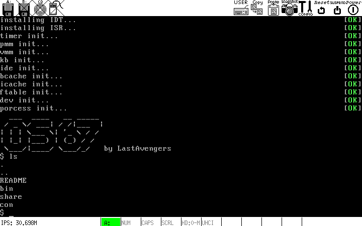

OS67
===============================
OS67 is a unix-like toy kernel, which comes with some user routines. (x86 based)




### Build requirements

Platform: Linux

* gnu make
* nasm
* gcc
* binutils(ld, objcopy)
* mkfs
* bochs 2.6.7+

### How to compile

```shell
git clone https://github.com/SilverRainZ/OS67.git
cd OS67
make init   # only for first time
make fs     # build root file system and user routines, root privilege required
make        # build kernel
make run    # run with bochs
```

### Syscalls list

```c
int _fork();
int _exit();
int _wait();
int _pipe(int *fd);
int _read(int fd, char *addr, uint32_t n);
int _kill(int pid);
int _exec(char *path, char **argv);
int _fstat(int fd, struct stat *stat);
int _chdir(char *path);
int _dup(int fd);
int _getpid();
int _sleep(uint32_t sec);
int _uptime();
int _open(char *path, uint32_t mode);
int _write(int fd, char *addr, uint32_t n);
int _mknod(char *path, uint32_t di);
int _unlink(char *path);
int _link(char *old, char *new);
int _mkdir(char *path);
int _close(int fd);
```

### User routines list

* sh: a simple shell, support IO redirect and pipe
* ls: list files
* cat: read from stdin and send it to stdout
* mkdir: make directory
* rm: remove file
* ...

#### Write youself a user routine

* add a new file in `usr/`: `touch usr/newroutine.c`
* add a new value to `UPROGS` variable in `Makefile` as follow:

```patch
- UPROGS =  bin/cinit bin/sh bin/cat bin/ls bin/mkdir bin/rm
+ UPROGS =  bin/cinit bin/sh bin/cat bin/ls bin/mkdir bin/rm bin/newroutine
```

* in newroutine.c you can use these header files:
    * usys.h: system call interfaces
    * uio.h: basic input output functions
    * string.h: basic string operate functions
* `make fs && make run` then you can run your user routine


### Bug report

See [Issues · SilverRainZ/OS67](https://github.com/SilverRainZ/OS67/issues)

Please paste the kernel logs in the issue.

Uncomment macro `__LOG_ON` as follow to enable logging of specific file:

```patch
- // #define __LOG_ON 1
+ #define __LOG_ON 1
```

### License

[GNU General Public License Version 3](https://github.com/SilverRainZ/OS67/blob/master/LICENSE)

### References

* [MIT 6.828 xv6](http://pdos.csail.mit.edu/6.828/2011/xv6.html)
* [xv6 中文文档](https://github.com/ranxian/xv6-chinese)
* [Bran's Kernel Developments Toturial](http://www.osdever.net/bkerndev/Docs/gettingstarted.htm)
* [Bran's Kernel Developments Toturial - 译言网](http://article.yeeyan.org/view/197439/161890)
* [wiki.osdev.org](http://wiki.osdev.org/Main_Page)
* [hurlex-doc](https://github.com/hurley25/hurlex-doc)
* [fleurix](https://github.com/Fleurer/fleurix)
* [Minix File System - Dr.John C.S.Lui](https://koala.cs.pub.ro/redmine/attachments/download/105/minix.pdf)
* [《Linux 内核完全注释》](http://book.douban.com/subject/1231236/)
* [《30天自制操作系统》](http://book.douban.com/subject/11530329/)
* [《Orange's 一个操作系统的实现》](http://book.douban.com/subject/3735649/)

### Thanks to

* [fleuria](http://fleurer-lee.com/)
* [郭家华](http://www.zhihu.com/people/guo-jiahua)
* [farseerfc](https://farseerfc.me/)
* [fixme](https://fbq.github.io/)
* nami

### Just for fun.
